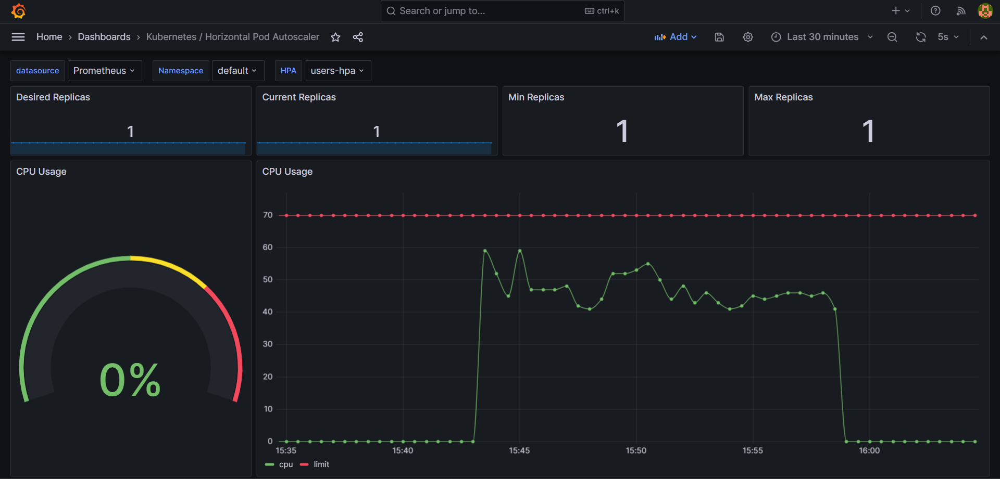
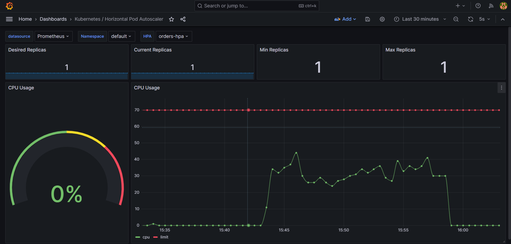
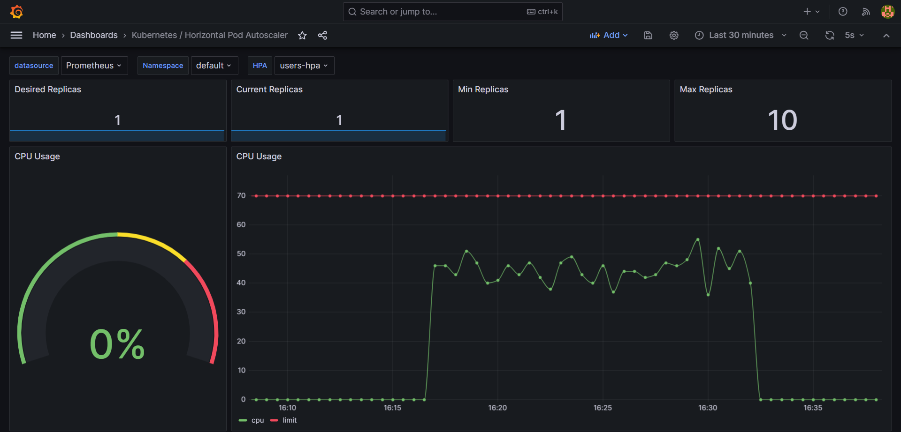
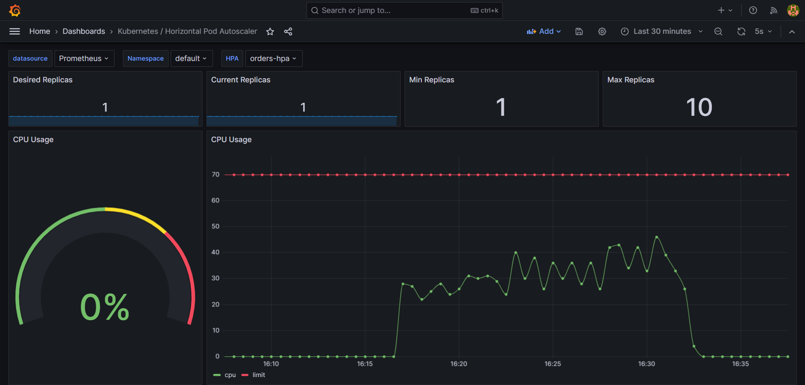
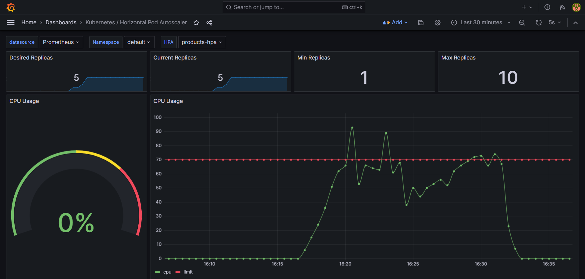

<h1 align="center">
  <p> 📑 Projeto de Arquitetura de Software - UFCG </p>
</h1>

## 📝 Objetivo

### 📍 Geral

Analisar o comportamento de um sistema que emprega uma arquitetura de microsserviços em seu backend. O foco é entender como o sistema reage quando um ou mais de seus microsserviços recebem uma carga elevada. Especial atenção é dada à maneira como o sistema gerencia essa sobrecarga, comparando cenários com e sem a implementação de autoscaling.

### 📍 Específico

O objetivo é realizar um teste de carga em um sistema com arquitetura de microsserviços, observando seu comportamento e as métricas resultantes. Em seguida, o mesmo teste será aplicado ao sistema, mas desta vez em um cenário que conta com um serviço de autoscaling ativo. A comparação desses dois cenários proporcionará insights importantes sobre o desempenho do sistema sob diferentes condições.

## ⚙️ Sistema

### 🔖 Descrição

O sistema é um backend para e-commerce com API em Node.js, organizado em microsserviços encapsulados em containers Docker. Segue os princípios da Clean Architecture, com um proxy server direcionando as solicitações. Utiliza MongoDB para gestão de dados, com modelos definidos pelo Mongoose. A comunicação entre certos microsserviços é feita através do RabbitMQ e do protocolo AMQP.

O código fonte deste sistema, que foi modificado para a realização do experimento, está disponível em um artigo detalhado no [Medium](https://medium.com/@nicholasgcc/building-scalable-e-commerce-backend-with-microservices-exploring-design-decisions-node-js-b5228080403b). Para uma compreensão mais profunda do projeto e das modificações realizadas, recomendamos a leitura deste artigo. O repositório completo do código fonte pode ser acessado [aqui](https://github.com/nicholas-gcc/nodejs-ecommerce-microservice).

### 📦 Arquitetura
A arquitetura do sistema, com as modificações aplicadas, é apresentada abaixo:


## 🪄 Experimento

### 🛠️ Ferramentas utilizadas

O experimento envolveu a utilização de várias ferramentas:

- [Docker](https://www.docker.com/get-started/) - Plataforma para desenvolvimento, deploy e execução de aplicações utilizando containers.
- [Kubernetes](https://kubernetes.io/) - Sistema de orquestração de containers.
- [Kind](https://kind.sigs.k8s.io/) - Ferramenta para criação de clusters Kubernetes locais.
- [Kubectl](https://kubernetes.io/docs/tasks/tools/install-kubectl/) - Ferramenta de linha de comando para interagir com o cluster Kubernetes.
- [Heml](https://helm.sh/docs/intro/install/) - Gerenciador de pacotes para Kubernetes.
- [Make](https://www.gnu.org/software/make/) - Ferramenta para automatizar a execução de tarefas.
- [k6](https://k6.io/) - Ferramenta para testes de carga.

### ⚖️ Migração da aplicação para o Kubernetes

 A migração completa da arquitetura do projeto, originalmente implementada no Docker, para o Kubernetes foi necessária. O Kubernetes oferece recursos avançados como Autoscaling e Load Balancer. Essas funcionalidades foram fundamentais para a decisão de migração.

#### 📦 Arquitetura Completa

A arquitetura completa oferece uma visão detalhada de todos os componentes e como eles interagem entre si.


#### 📦 Arquitetura Simplificada

A arquitetura simplificada fornece uma visão geral do sistema, focando nos componentes principais.


### 💡 Observações

#### 📌 Configuração do HPA (Horizontal Pod Autoscaling) no Kubernetes
- **Limite de CPU:** 70%
- **Número de réplicas mínimas:** 1
- **Número de réplicas máxima:** 10

#### 📌 Configuração do teste de carga com o K6
Realizamos três testes em paralelo durante um período de 15 minutos. Cada teste focou em um microsserviço específico e usou uma quantidade diferente de usuários virtuais (VUs).

- Microsserviço de Usuários
    - **Endpoin:** _GET_ /users
    - **Carga:** Constante
    - **Usuários Virtuais (VUs)**: 15

- Microsserviço de Ordens de Compras
    - **Endpoint:** _GET_ /orders
    - **Carga:** Constante
    - **Usuários Virtuais (VUs):** 10

- Microsserviço de Produtos
    - **Endpoint:** _GET_ /products
    - **Carga:** Variável, dividida em 3 estágios:
        - **Estágio 1:** 30 VUs por 5 minuto
        - **Estágio 2:** 60 VUs por 5 minutos
        - **Estágio 3:** 90 VUs por 5 minutos

### 🚀 Deploy da aplicação no Kubernetes

Para realizar o deploy da aplicação no Kubernetes, siga os passos abaixo:

1. Criar o cluster Kubernetes local:
    ```bash
    kind create cluster
    ```
2. Configurar o monitoramento da aplicação instalando o [kube-prometheus-stack](https://artifacthub.io/packages/helm/prometheus-community/kube-prometheus-stack):
    ```bash
    make add-prometheus-stack
    ```
3. Construir as imagens Docker dos microsserviços:
    ```bash
    make docker-build-all
    ```
4. Fazer o load das imagens Docker no cluster Kubernetes (Processo demorado):
    ```bash
    make kind-load-docker-images
    ```
5. Realizar o deploy da aplicação:
    ```bash
    make kube-up
    ```
6. Verificar se a aplicação e o monitoramento estão funcionando corretamente. Todos os serviços devem estar com o status `Running`:

   6.1 Verificando aplicação
    ```bash
    kubectl get pods
    ```

    6.2 Verificando o monitoramento
    ```bash
    kubectl get pods -n monitoring
    ```

### ✅ Preparação do teste de carga

1. Levantar o ambiente para a execução:
    ```bash
    make k6-up
    ```

### ⚠️ Realizar o experimento
1. Expor o api-gateway para acesso externo:
    ```bash
    make kube-expose-app
    ```

2. Expor o Grafana do Kubernetes para acesso externo:
    ```bash
    make kube-expose-grafana
    ```

3. Importar o dashboard do Kubernetes no grafana:

    3.1 Acessar o [grafana do Kubernetes](http://localhost:3000)

    3.2 Importar o dashboard [Kubernetes Horizontal Pod Autoscaler](./grafana/dashboards/Kubernetes_Horizontal_Pod_Autoscaler.json)

4. Importar o dashboard do K6 no grafana:

    4.1 Acessar o [grafana do K6](http://localhost:3001)

    4.1 Configurar a conexão com o InfluxDB:
   * URL: `http://influxdb:8086`
   * Database: `k6`

    4.2 Importar o dashboard [k6 Load Testing Results](./grafana/dashboards/k6_Load_Testing_Results.json)
        
6. Iniciar o teste de carga:
    ```bash
    make k6-run
    ```
7. Acompanhar o dashboard do K6 e do Kubernetes para verificar o comportamento da aplicação e os resultados do teste.

8. Ao finalizar o teste de carga devemos:

    7.1 Derrubar o ambiente de execução do K6:
    ```bash
    make k6-down
    ```

    7.2 Derrubar o ambiente de execução da aplicação:
    ```bash
    make kube-down
    ```

## 🪄 Resultados

### ❌ Sem Autoscaling

>Microsserviço de Usuários



> Microsserviço de Ordens de Compras



>Microsserviço de Produtos


>Resultados K6


#### ✅ Com Autoscaling

>Microsserviço de Usuários



> Microsserviço de Ordens de Compras



>Microsserviço de Produtos



>Resultados K6


